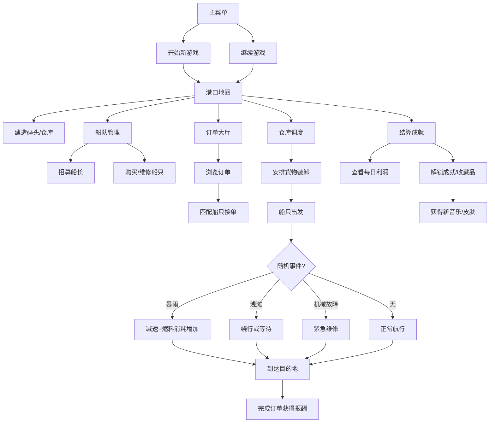

## 1. 产品概述

《港湾岁月》是一款复古像素风桌面经营游戏，玩家扮演港口小镇的管理者，通过修建码头仓库、招募船长、调度船只完成货运订单来发展小镇。游戏融合资源管理、策略调度和随机事件，玩家需要平衡收支、应对突发状况、解锁新区域，最终打造繁荣的港口帝国。

- 目标用户：模拟经营游戏爱好者、像素复古风格玩家、休闲策略玩家
- 产品价值：提供深度策略体验与怀旧像素美学的结合，支持碎片化时间游玩

## 2. 核心功能

### 2.1 用户角色

| 角色 | 注册方式 | 核心权限 |
|------|----------|----------|
| 玩家 | 本地存档 | 完整游戏体验，包括建造、经营、调度、收集成就 |

### 2.2 功能模块

1. **主菜单界面**：开始新游戏、继续游戏、游戏设置、退出游戏
2. **港口地图界面**：像素风港口全景、码头仓库建造、船只航线可视化、小镇装饰展示
3. **船队管理界面**：招募/解雇船长、购买/维修船只、升级装卸速度、燃料管理
4. **订单大厅界面**：订单浏览、限时订单、订单接取、货物匹配
5. **仓库调度界面**：库存管理、货物分类、装卸调度、仓库升级
6. **结算成就界面**：每日利润报表、成就系统、复古音乐解锁、角色皮肤收集

### 2.3 页面详情

| 页面名称 | 模块名称 | 功能描述 |
|----------|----------|----------|
| 主菜单 | 游戏标题 | 像素动画 LOGO，复古字体展示 |
| 主菜单 | 菜单按钮 | 新游戏、继续、设置、退出，点击音效反馈 |
| 主菜单 | 背景动画 | 动态像素港口夜景，船只航行动画 |
| 港口地图 | 地图视图 | 12x8 网格像素地图，可点击建造区域 |
| 港口地图 | 建造面板 | 码头(3种等级)、仓库(3种等级)、装饰建筑 |
| 港口地图 | 航线显示 | 船只航行路径动画，实时位置更新 |
| 港口地图 | 事件通知 | 暴雨、浅滩、机械故障事件弹窗 |
| 港口地图 | 河段解锁 | 支付金币解锁新河段，扩展可航行区域 |
| 船队管理 | 船长列表 | 显示招募的船长，包含技能、等级、工资 |
| 船队管理 | 船长招募 | 船长池刷新，消耗金币招募，技能随机 |
| 船队管理 | 船只列表 | 船只状态(空闲/航行/维修)、载重、速度、燃料 |
| 船队管理 | 船只操作 | 维修(消耗金币)、补给燃料(消耗金币)、出售 |
| 船队管理 | 升级系统 | 装卸速度升级、引擎升级、船体加固 |
| 订单大厅 | 订单列表 | 显示可接订单：货物类型、重量、目的地、报酬、时限 |
| 订单大厅 | 订单接取 | 选择船只接单，匹配载重与货物重量 |
| 订单大厅 | 限时订单 | 高报酬限时任务，倒计时显示 |
| 订单大厅 | 航线匹配 | 智能推荐合适船只，载重不足警告 |
| 仓库调度 | 库存概览 | 分类显示货物数量、重量、价值 |
| 仓库调度 | 装卸任务 | 安排货物装卸，显示装卸进度 |
| 仓库调度 | 仓库容量 | 当前容量/最大容量，升级扩展容量 |
| 仓库调度 | 货物管理 | 货物排序、筛选、紧急标记 |
| 结算成就 | 每日结算 | 收入/支出明细，利润图表，连续天数记录 |
| 结算成就 | 成就系统 | 成就图标、解锁条件、奖励展示 |
| 结算成就 | 收藏品 | 复古音乐播放器、角色皮肤切换、小镇装饰 |
| 结算成就 | 统计数据 | 总订单数、总利润、航行里程、解锁进度 |

## 3. 核心流程

玩家从主菜单开始游戏，进入港口地图查看小镇状态。首先需要建造码头和仓库，然后在船队管理招募船长购买船只，接着前往订单大厅接取货运订单，在仓库调度安排货物装卸，最后船只出发完成运输。航行中可能遇到随机事件需要处理，完成订单获得报酬。每日结算查看利润，达成条件解锁成就和收藏品。

## 4. 用户界面设计

### 4.1 设计风格

**复古像素美学**：
- 主色调：深靛蓝 `#1a2744`、暖沙黄 `#e8c170`、海雾蓝 `#4a6fa5`、木棕 `#8b5a2b`
- 辅助色：珊瑚红 `#e06c75`、苔藓绿 `#6a8c5f`、船帆白 `#f0e6d2`
- 整体风格：8-bit 像素风，色块拼接，像素描边，CRT 扫描线效果
- 按钮：立体像素按钮，按下有凹陷效果，1px 高光+2px 阴影
- 字体：像素字体 "Press Start 2P" 搭配 "VT323" 等宽字体
- 界面框架：深木色面板，金色装饰边角，复古卷轴效果
- 图标：16x16 像素图标，使用 Unicode 方块字符和 emoji 组合
- 动画：帧动画(3-5帧)，像素粒子效果，船只摆动动画

### 4.2 页面设计概述

| 页面名称 | 模块名称 | UI 元素 |
|----------|----------|---------|
| 主菜单 | 标题区 | 大像素字体游戏名，波浪动画，海鸥像素飞过 |
| 主菜单 | 按钮区 | 垂直排列像素按钮，悬停抖动效果 |
| 主菜单 | 背景 | 像素港口日落，水面波纹动画，远处船影 |
| 港口地图 | 顶部栏 | 金币、日期、天气、通知图标，点击展开详情 |
| 港口地图 | 地图区 | 12x8 网格，可建造区域高亮，建筑像素图标 |
| 港口地图 | 侧边栏 | 建造菜单：码头、仓库、装饰，造价显示 |
| 港口地图 | 底部栏 | 导航按钮：船队、订单、仓库、结算 |
| 船队管理 | 船长区 | 卡片式布局，船长像素头像，技能标签 |
| 船队管理 | 船只区 | 横向滚动船只列表，状态颜色标识 |
| 船队管理 | 升级区 | 进度条显示升级等级，消耗金币按钮 |
| 订单大厅 | 订单列表 | 卡片堆叠，限时订单红色边框倒计时 |
| 订单大厅 | 订单详情 | 展开显示货物清单，推荐船只列表 |
| 订单大厅 | 接取确认 | 模态弹窗，载重匹配度显示，确认按钮 |
| 仓库调度 | 库存区 | 分类标签页，货物像素图标，数量显示 |
| 仓库调度 | 装卸区 | 进度条动画，工人像素走动 |
| 仓库调度 | 容量条 | 渐变色容量条，接近上限警告 |
| 结算成就 | 利润区 | 复古收银机样式，数字滚动动画 |
| 结算成就 | 成就区 | 网格布局，已解锁彩色/未解锁灰度 |
| 结算成就 | 收藏品区 | 音乐播放器、皮肤预览、装饰展示 |

### 4.3 响应式

- 桌面端优先设计，固定分辨率 1280x720 像素窗口
- 支持窗口缩放，保持像素比例不模糊
- 平板端自适应缩放，触摸操作优化按钮尺寸
- 移动端简化布局，垂直堆叠界面元素

### 4.4 像素场景指导

**港口地图场景**：
- 环境：黄昏港口，柔和暖光，水面反射建筑倒影
- 图层：背景远山→中景建筑→前景码头水面
- 建筑：码头木桩、仓库屋顶、灯塔旋转光束
- 动画：海浪逐帧动画、烟囱冒烟、起重机摆动
- 船只：吃水深度随载重变化，航行尾流效果
- 后处理：CRT 扫描线叠加，轻微色差，暗角效果
- 性能：限制同时显示动画元素数量 ≤ 20，单帧绘制时间 < 16ms
