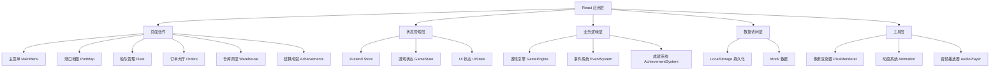
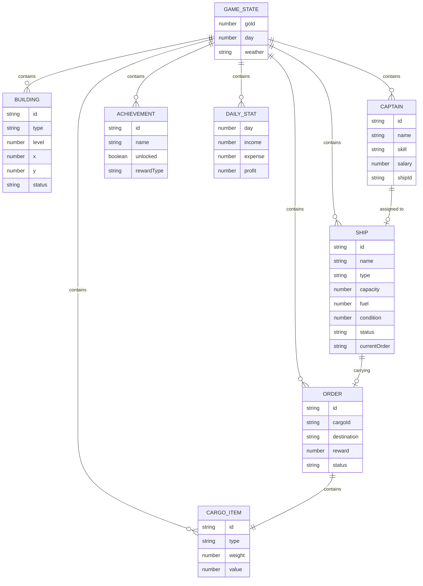

## 1. 架构设计



## 2. 技术描述

- **前端框架**: React@18 + TypeScript@5 + Vite@5
- **状态管理**: Zustand@4 (轻量级，适合游戏状态)
- **样式方案**: TailwindCSS@3 + 自定义 CSS 像素样式
- **像素渲染**: HTML5 Canvas + 自定义像素绘制工具
- **动画系统**: requestAnimationFrame + 帧动画管理器
- **音频系统**: Web Audio API + 8-bit 音效合成
- **数据持久化**: LocalStorage (自动存档)
- **构建工具**: Vite@5 (快速开发与构建)
- **初始化方式**: `npm create vite@latest -- --template react-ts`

## 3. 路由定义

| Route | 页面名称 | 用途 |
|-------|----------|------|
| `/` | 主菜单 | 游戏入口，新游戏/继续/设置 |
| `/port` | 港口地图 | 核心游戏界面，建造与航行 |
| `/fleet` | 船队管理 | 船长招募、船只管理、升级 |
| `/orders` | 订单大厅 | 订单浏览、接取、匹配 |
| `/warehouse` | 仓库调度 | 库存管理、装卸任务 |
| `/achievements` | 结算成就 | 利润统计、成就解锁、收藏品 |

## 4. API 定义 (Mock)

```typescript
// 游戏状态类型
interface GameState {
  gold: number;
  day: number;
  weather: 'sunny' | 'rainy' | 'stormy';
  unlockedSections: string[];
  buildings: Building[];
  captains: Captain[];
  ships: Ship[];
  orders: Order[];
  cargo: CargoItem[];
  achievements: Achievement[];
  dailyStats: DailyStat[];
}

interface Building {
  id: string;
  type: 'dock' | 'warehouse' | 'decoration';
  level: 1 | 2 | 3;
  position: { x: number; y: number };
  status: 'building' | 'operational' | 'damaged';
  buildProgress?: number;
}

interface Captain {
  id: string;
  name: string;
  avatar: string;
  level: number;
  skill: 'speed' | 'cargo' | 'navigation' | 'maintenance';
  skillLevel: number;
  salary: number;
  shipId?: string;
  hired: boolean;
}

interface Ship {
  id: string;
  name: string;
  type: 'small' | 'medium' | 'large';
  capacity: number;
  speed: number;
  fuel: number;
  maxFuel: number;
  condition: number;
  status: 'idle' | 'sailing' | 'loading' | 'repairing';
  position: { x: number; y: number };
  targetPosition?: { x: number; y: number };
  currentOrder?: string;
  progress: number;
  upgrades: {
    loading: number;
    engine: number;
    hull: number;
  };
}

interface Order {
  id: string;
  cargo: CargoItem;
  destination: string;
  distance: number;
  reward: number;
  timeLimit?: number;
  deadline?: number;
  status: 'available' | 'accepted' | 'completed' | 'failed';
  difficulty: 'easy' | 'medium' | 'hard';
}

interface CargoItem {
  id: string;
  type: 'wood' | 'coal' | 'grain' | 'textiles' | 'machinery' | 'luxury';
  name: string;
  weight: number;
  value: number;
  icon: string;
}

interface Achievement {
  id: string;
  name: string;
  description: string;
  icon: string;
  unlocked: boolean;
  reward: {
    type: 'music' | 'skin' | 'decoration' | 'gold';
    value: string;
  };
  condition: {
    type: 'orders' | 'profit' | 'days' | 'ships' | 'buildings';
    target: number;
    current: number;
  };
}

interface DailyStat {
  day: number;
  income: number;
  expense: number;
  ordersCompleted: number;
  profit: number;
}

// 游戏引擎接口
interface GameEngine {
  tick(deltaTime: number): void;
  handleEvent(event: GameEvent): void;
  completeOrder(orderId: string): void;
  failOrder(orderId: string): void;
}

// 事件类型
type GameEvent = 
  | { type: 'storm'; shipId: string; damage: number }
  | { type: 'shoal'; shipId: string; delay: number }
  | { type: 'breakdown'; shipId: string; repairCost: number }
  | { type: 'new_order'; order: Order };
```

## 5. 数据模型

### 5.1 ER 图



### 5.2 初始数据 (Mock)

```typescript
// 初始游戏状态
const initialGameState: GameState = {
  gold: 5000,
  day: 1,
  weather: 'sunny',
  unlockedSections: ['section_a'],
  buildings: [
    { id: 'dock_1', type: 'dock', level: 1, position: { x: 2, y: 5 }, status: 'operational' },
    { id: 'warehouse_1', type: 'warehouse', level: 1, position: { x: 3, y: 3 }, status: 'operational' }
  ],
  captains: [
    { id: 'captain_pool_1', name: '老张', avatar: '👨‍✈️', level: 1, skill: 'navigation', skillLevel: 2, salary: 50, hired: false },
    { id: 'captain_pool_2', name: '李航海', avatar: '🧔', level: 2, skill: 'speed', skillLevel: 3, salary: 80, hired: false }
  ],
  ships: [
    {
      id: 'ship_1', name: '海鸥号', type: 'small', capacity: 50, speed: 3,
      fuel: 100, maxFuel: 100, condition: 100, status: 'idle',
      position: { x: 2, y: 5 }, progress: 0,
      upgrades: { loading: 1, engine: 1, hull: 1 }
    }
  ],
  orders: [
    { id: 'order_1', cargo: { id: 'cargo_1', type: 'wood', name: '木材', weight: 30, value: 200, icon: '🪵' }, destination: '河口镇', distance: 5, reward: 300, status: 'available', difficulty: 'easy' },
    { id: 'order_2', cargo: { id: 'cargo_2', type: 'grain', name: '粮食', weight: 40, value: 300, icon: '🌾' }, destination: '山城', distance: 8, reward: 500, timeLimit: 120, deadline: 120, status: 'available', difficulty: 'medium' }
  ],
  cargo: [
    { id: 'stock_1', type: 'wood', name: '木材', weight: 100, value: 200, icon: '🪵' },
    { id: 'stock_2', type: 'coal', name: '煤炭', weight: 80, value: 350, icon: '⬛' }
  ],
  achievements: [
    { id: 'first_order', name: '首航成功', description: '完成第一笔订单', icon: '⭐', unlocked: false, reward: { type: 'gold', value: '500' }, condition: { type: 'orders', target: 1, current: 0 } },
    { id: 'ten_orders', name: '货运老手', description: '完成10笔订单', icon: '🏆', unlocked: false, reward: { type: 'music', value: 'sea_shanty' }, condition: { type: 'orders', target: 10, current: 0 } }
  ],
  dailyStats: []
};
```

## 6. 目录结构

```
src/
├── components/
│   ├── MainMenu/
│   │   ├── MainMenu.tsx
│   │   └── MainMenu.module.css
│   ├── PortMap/
│   │   ├── PortMap.tsx
│   │   ├── MapCanvas.tsx
│   │   ├── BuildPanel.tsx
│   │   └── EventPopup.tsx
│   ├── Fleet/
│   │   ├── FleetManagement.tsx
│   │   ├── CaptainCard.tsx
│   │   ├── ShipCard.tsx
│   │   └── UpgradePanel.tsx
│   ├── Orders/
│   │   ├── OrderHall.tsx
│   │   ├── OrderCard.tsx
│   │   └── AcceptModal.tsx
│   ├── Warehouse/
│   │   ├── Warehouse.tsx
│   │   ├── CargoList.tsx
│   │   └── LoadingQueue.tsx
│   ├── Achievements/
│   │   ├── Achievements.tsx
│   │   ├── ProfitPanel.tsx
│   │   ├── AchievementGrid.tsx
│   │   └── CollectionPanel.tsx
│   └── shared/
│       ├── PixelButton.tsx
│       ├── PixelPanel.tsx
│       ├── TopBar.tsx
│       ├── BottomNav.tsx
│       └── ProgressBar.tsx
├── store/
│   ├── useGameStore.ts
│   └── useUIStore.ts
├── engine/
│   ├── GameEngine.ts
│   ├── EventSystem.ts
│   └── AchievementSystem.ts
├── types/
│   └── game.ts
├── utils/
│   ├── pixelRenderer.ts
│   ├── animation.ts
│   ├── audio.ts
│   └── storage.ts
├── data/
│   └── mockData.ts
├── hooks/
│   ├── useGameLoop.ts
│   └── usePixelCanvas.ts
├── App.tsx
├── main.tsx
└── index.css
```

## 7. 关键技术决策

1. **Canvas 像素渲染**：使用 Canvas 绘制像素地图和船只动画，保证像素风格纯正，性能优于 DOM 操作
2. **游戏循环 Hook**：自定义 `useGameLoop` hook 封装 requestAnimationFrame，统一管理游戏 tick
3. **Zustand 状态管理**：轻量级，无需 Provider 包裹，支持选择器优化渲染，适合游戏频繁状态更新
4. **自动存档**：状态变化后 2 秒节流写入 LocalStorage，防止频繁 IO
5. **像素字体处理**：使用 Google Fonts 的 Press Start 2P 和 VT323，配合 CSS `image-rendering: pixelated`
6. **事件系统**：发布订阅模式，随机事件按概率触发，可配置事件权重
7. **动画系统**：帧动画管理器，支持 3-5 帧循环动画，船只航行动画使用线性插值
